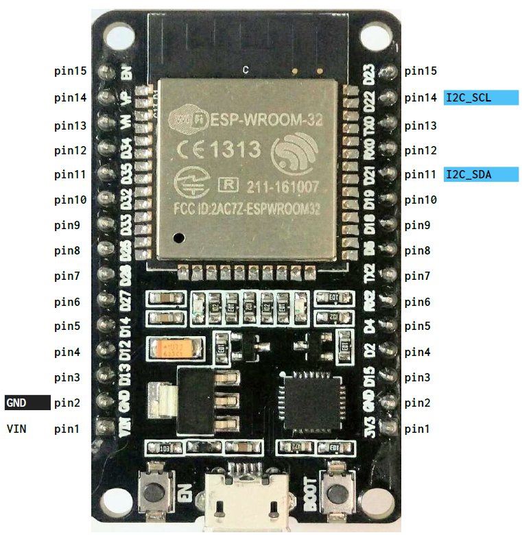

# Building a Weather Station for Scouts

## Parts
- Get a ESP32 DevKitV1 board such as [here](https://www.aliexpress.com/item/ESP32-ESP-32-ESP32S-ESP-32S-CP2102-Wireless-WiFi-Bluetooth-Development-Board-Micro-USB-Dual-Core/32928267626.html)
- Get a BME280 temperature/humidity/pressure sensor such as [here](https://https://www.aliexpress.com/item/BME280-Digital-Sensor-Temperature-Humidity-Barometric-Pressure-Sensor-Module-I2C-SPI-1-8-5V-GY-BME280/32849462236.html)
- Get some jumper cables to wire your BME280 to the ESP32 or a breadboard
- A power supply

## Software
- Download the CP210x Virtual COM driver [here] *this allows you to connect to the ESP32*(https://www.silabs.com/products/development-tools/software/usb-to-uart-bridge-vcp-drivers)
- Get Arduino IDE [here](https://www.arduino.cc/en/Main/Software)
- Install the ESP32 board following instructions [instructions taken from here](https://github.com/espressif/arduino-esp32/blob/master/docs/arduino-ide/boards_manager.md)
  - Start Arduino and open Preferences window
  - Enter ```https://dl.espressif.com/dl/package_esp32_index.json``` into *Additional Board Manager URLs* field
  - Open Boards Manager from Tools > Board menu. Search for  *esp32* platform (and install it)
  - Select *ESP32 Dev Module* board from Tools > Board

## Upload the code
- Download *arduino/ScoutWeather/ScoutWeather.ino*
- Double click *ScoutWeather.ino* to open in Arduino IDE
- Set your WiFi ssid where it says *[YOUR WIFI NAME]* i.e. *BT Home Hub5 AAAA*
- Set your WiFi password where it says *[YOUR WIFI PASS]* i.e. *aaa00aa000*
- Set your API location where it says *[YOUR API HERE]* i.e. *https://some.web/api/Weather*
- Connect the Arduino
- Press the "Play" button to upload
- The bottom screen will notify you the hardware reset is complete
- Press Tools > Serial Monitor to see the content coming back

## Wiring
- Wiring taken from [here](https://github.com/playelek/pinout-doit-32devkitv1)


## API endpoint
- A copy of the API endpoint can be found in api